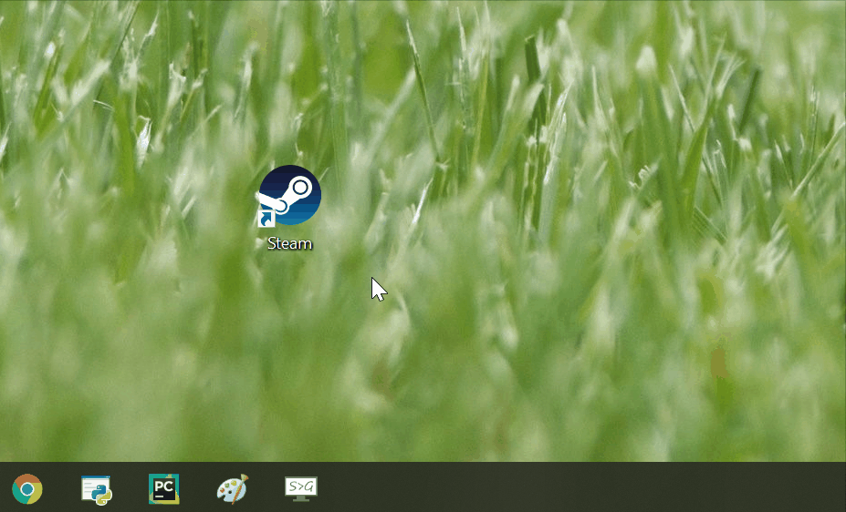
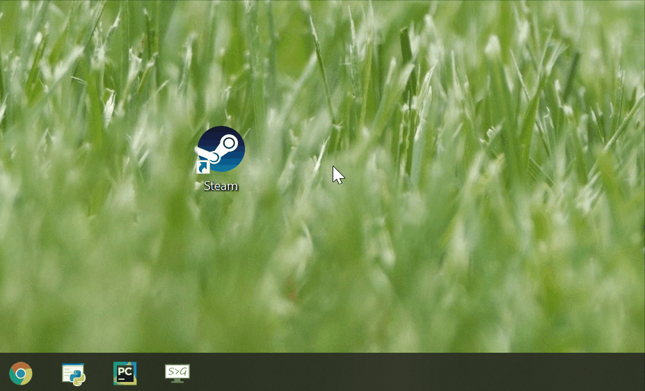

# ChopChop:<br> lightweight snipping tool

ChopChop was created as an alternative for bulkier screenshot tools such as
windows default snipping tool or Screenpresso.

The goal is to be as quick, lightweight and minimalistic as possible - to accomplish
the same things with fewest mouse clicks possible.

Main characteristics:
-
- You start snipping immediately after running ChopChop - 
this will be indicated by cursor changing to crosshair
- There is no static menu or window 
- You choose what you want to do with your
snip by using the contextual menu that appears after you select the area
- If you press ESC at any stage, ChopChop is gone and out of your way
- Default saving behavior is to just give the name of the file (it will be saved at a default location) - if you're 
taking a bunch of screenshots in quick succession, no need to go through the browse window every time.
- Pop open the default folder at any time - just right click anywhere in 
snipping mode or with context menu open to see all your saved snips
- If you want to edit your snip, just choose Edit option from the context menu - it will immediately open in MS Paint

How to use ChopChop
-
copy image to clipboard

 
save image to file



edit image in MS paint


create a delayed snip


<br><br>

- to see all your previously saved snips, 
just press right mouse button anywhere on the screen
or choose "folder" option from the context menu

- pick the "email" option from context menu to create a new email
with your snip in the body (requires email client, eg. Outlook)

- pick "edit" to open the current snip in MS paint to edit and copy/save

- to create a delayed snip, choose the "delay" option and pick delay in seconds using the slider

Installing ChopChop in 3 steps:
-
(make sure you have Python3 and git installed)
- clone this repository to your computer with <br> 
```git clone https://github.com/raczynskid/ChopChop.git```<br>
- install the requirements with <br> 
```pip install requirements txt```<br>
- create a shortcut where target is <br>
```[path to your pythonw (the "w" means no console window)][space][path to __main__.py]```
example:


<br>

Pyinstaller .exe package is also available in the "build" folder, however it's been known to cause issues
with Windows security and/or antivirus software. For most cases, it's preferable to run ChopChop from .py files as
described above.

<br>

Contributing to ChopChop
-
If you want to help improve ChopChop, feel free to fork this repository or log an issue/enhancement.
Keep in mind the main goal is to keep the UI to an absolute minimum! Make sure your feature does not 
add too many knobs, ticks or buttons!